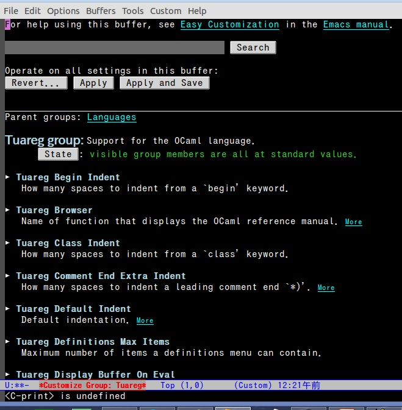

my-emacs-setting-file
=====================

# このファイルについて
このファイルは私が便利だと思われるEmacs拡張の中で、
OCamlを書く研究室の人にも便利だろうと思ったもの集めて単純化したEmacsの設定ファイルの例です。
Emacs24.4を使うことを仮定しております。
Emacs24からはELPAというEmacsの拡張elispのバージョン管理ソフトが標準搭載されており、これを使えば楽に拡張elispをインストールできるため最新版を推奨します。

この設定は、Emacsチュートリアルは終わったがどういうふうに拡張したら良いのかわからない人に一応の例を示すためのものです。
そのまま使うことも出来ます。

# Emacsのインストール
[GNU Emacs](http://www.gnu.org/software/emacs/#Obtaining)のページからNear GNU Serverのページにアクセスし、最新版のEmacsのソースをダウンロードします(執筆時では24.4)。emacs-24.4.tar.gzをダウンロードしたとして、

- cd ~/Download
- tar zxvf ./emacs-24.4.tar.gz
- cd emacs-24.4/
- ./configure
- make
- sudo make install

でインストールできます。上のファイルはUbuntuでの場合を想定してます。ブラウザで普通にクリックしてダウンロードすると、~/Downloadにファイルがダウンロードされますが、他の場所にダウンロードした場合はその場所にcdしてください。

# 補足
コマンドの表記を一応示します。
CはCtrlキー, MはAltキーを表します。C-sなどのC or M - <key> は同時押しの表記です。C-sの場合、Ctrlを押しながらsを押すことを表します。

# 使い方
- git clone <このレポジトリのURL>
- すべてのファイルを~/.emacs.dにコピー
- cd ~/.emacs.d
- emacs --script ./recommend-install.el
- emacs を実行する

キーバインドの設定が甘いので、各自設定してください。
(define-key global-map (kbd "keys") 'function) がglobalにキーバインドを設定するためのフォームです。
(define-key global-map [(keys)] 'function) のように書くことも出来ます。
例は双方についてファイル中に見つけることが出来ます。

# この設定ファイルで何が変わること・便利な使い方
## 見た目
* はじめからテーマが黒を基調としたものに変更されている
気に入らない場合はEmacs上のOption -> Customize Emacs -> Customize Themesから変えられます
* どのカッコが対応しているのかわかるように、カッコの上にカーソルがあるとき対応している範囲に色がつくようになっている
* タイトルバーに時計が表示る
* タイトルバーに現在行とその行で何文字目なのか表示される
* 領域を選択した最、選択した領域の情報（行数、文字数）がタイトルバーに表示される
*

括弧の上にカーソルをおいた時、色がキツいという人は、M-x _list-colors-display_から好きな色を選んでみてください。

## OCamlプログラミング用
OCamlプログラミングのために、

* tuareg-mode
* merlin
* ocp-indent
* ocamldebug
* utop
* ocamlspot (自動的には入りません)

を設定しています。opamを使うことを想定していますので、opamを
[OCaml: DebianでのOCamlの開発環境セットアップ2013年暮れ版](http://no-maddojp.hatenablog.com/entry/2013/12/26/232400)
などをみてインストールするとよいでしょう。opam, utopの概略の説明もしています。

それから opam install merlin ocp-indent utop
と端末で叩いてください。

merlinについては
[OCaml: merlinでcompilerのコードを補完できるようにする](http://no-maddojp.hatenablog.com/entry/2014/12/01/022007)
を見てください。
OCamlをヘビーに使うためには、merlinかocamlspot、最悪caml-type.elが使いこなせないと厳しいと思います。

## 最近開いたファイルから開く
基本的には、_recentf-open-files_(C-x h)から最近開いたファイルを開けるようになってます。
一度開いたファイルはそこのなかでインクリメントサーチして（C-s）探すようにします。
そのために保存する履歴の数を10000, 表示する数を1000にしています。

## find-file(C-x C-f)を便利に使う
それ以外にも_ffap-bindings_のおかげで、カーソルがディレクトリやURL上にあるときfind-fileを実行すると

* ディレクトリの上ではデフォルトの値にそのディレクトリが入っている
* URL上ではURLをブラウザで開く

という動作になります。

これは非常に便利で、あらゆる場所にリンクを埋め込めることを意味します。
例えばプログラムを書いている時に参考にしたウェブページのURLをコメントの中に書いておくと、Emacs上から瞬時に開くことが出来ます。
また外部ファイルにメモを残して、それにリンクを貼るような使い方ができます。

## view-modeを使う
_view-mode_はread-onlyのとき、独自のキーバインディングを使うために閲覧モードです。
C-qでこれに移行することが出来ます。
これに片手でファイルをブラウズできるように、キーバインドを設定しました。

* viのように、hjklに各種移動を割り当て、
* n, pでページ単位の移動を行い、
* iでC-lに割り当てられているカーソルが中央にくるように移動する

というような設定になっています。
自分でこれは好きなように設定してくことが望ましいです。
view-modeを使用すれば小指にかかる負担も軽減されます。

## popwinの取り扱い
popwinは、補完候補を表示するウインドウをポップアップのような形で登場させる拡張です。これは非常便利で、例えばバッファの補完をしていると、Emacs標準では2画面分割しているときなどでは、画面の状態を補完ウインドウを表示させるために崩してしまいます。
popwinではC-gを押せばポップアップした画面は消えるので、ウインドウの状態を破壊しません。

_popwin_については激しく挙動が変化するため、合わないと思ったら設定のコメントを読んで機能を停止させてください。
_popwin_を便利に使うときには、必ずなにかのキーにpopwinのキーマップ_popwin:keymap_を割り振ってください。
例ではC-zとS-vに割り振っています。

(popwin-mode 1) を実行することで、**で囲まれたバッファなどは下からポップアップする形で表示されるようになります。
これは、邪魔であればC-gを連打することで消すことが出来ます。

しかし、時々ポップアップされるバッファをちゃんと読みたい時があります。
そういう時には、C-z k でそのバッファを大きな画面で開くことが出来ます。

また、ポップアップされたバッファを消してしまい、もう一度見たいときにはC-z jでそれをもう一度ポップアップさせることができます。

他にも便利なキーバインドはありますが、これだけわかっていれば大丈夫です。

## switch-to-buffer (C-x b)の強化
* 部分文字列でバッファを選択できる
* C-s, C-rでバッファを選ぶことが出来る

C-x bはよく叩くコマンドなので、このカイゼンは強力です

## org-mode
org-modeはmarkdownに似たプレーンテキストを装飾されたテキストのように扱うモードです。
拡張子を.orgにすると自動でorg-mode開かれます。
M-x org-present でスライドショーのようなことも出来ます
プレゼンに便利なように、画像のサイズを調整できるようにimage+という拡張が入っています

## gitとの連携
インストールする拡張の中にmagit, git-guitterがあります。
magitはEmacsからgitを扱う便利なインターフェイスです。
[Emacs Magitメモ](http://www.magiccircuit.com/emacs-magit%E3%83%A1%E3%83%A2)
などを見てください。Emacsの拡張の中でも特にお勧めです。

gitについては
[デザイナのためのGit入門](http://www.slideshare.net/dsuket/git-16343460?ref=http://www.find-job.net/startup/7-git-slides)
をみると良いと思います。

git-guitterはGitのコミットと現在のコードをdiffをとって変更点をマークしてくれる拡張です。また、マークしている部分でHistoryを見たり、その部分の変更だけを元に戻したり出来ます。

## その他
common.elの中で解説しています

## 雑多なこと
* F11でフルスクリーン
* F12で最大化
* Shift+矢印で分化した画面を移動できる
* 領域を選択してない時、C-wは1ワード削除に割り当てられる

# カスタマイズ
## まずやるカスタマイズ
Emacsの上のタブのOptionから

* Highlight Matching ParenthesesをOnにしたり、
* Show/HideでTool-barを非表示にしてみたり、
* Option -> Customize Emacs -> Custom Themes からテーマを変更すると良いと思います。

## キーバインドの変更
Emacsは設定を書くことによって機能の割り当てキーを変更することが出来ます。

> (define-key global-map (kbd "C-x k") 'kill-line)

この1行により、C-x kにkill-line(カーソルの行でカーソルから行末まで削除する機能を割り当てることが出来ます。kill-lineはC-kに標準で割り当ててあるのであまりこの設定の意味はないかもしれません。

詳しくは[キーバインディング - 環境設定のための Emacs Lisp 入門](http://yohshiy.blog.fc2.com/blog-entry-271.html)などを参照してください。
(研究室にある[Emacs実践入門](http://www.amazon.co.jp/Emacs%E5%AE%9F%E8%B7%B5%E5%85%A5%E9%96%80-%EF%BD%9E%E6%80%9D%E8%80%83%E3%82%92%E7%9B%B4%E6%84%9F%E7%9A%84%E3%81%AB%E3%82%B3%E3%83%BC%E3%83%89%E5%8C%96%E3%81%97%E3%80%81%E9%96%8B%E7%99%BA%E3%82%92%E5%8A%A0%E9%80%9F%E3%81%99%E3%82%8B-WEB-DB-PRESS-plus/dp/4774150029)を読んでも良いと思います)

[るびきち「日刊Emacs」](http://rubikitch.com/2014/09/10/bind-key/)にキー割り当てを楽にする拡張について解説されているので、煩雑に思うならばこれを活用しても良いかもしれません。

## GUI操作による設定の変更
M-x customizeからGUI操作によって設定を変更することが出来ます。  
それっぽい名前の設定を検索から絞り込んでも良いし、Programmingなどカテゴリから弄りたいものを探しても良いと思います。  
具体的にこの機能をいじりたい、というのがわかっていれば M-x customize-group から機能の名前を入力し、変更できる要素一覧を見ることが出来便利です。

## ELPA
Emacsにはパッケージ管理の拡張が標準ではいっており、簡単に拡張プラグインをインストールすることが出来ます。package.elがそれです。
M-x list-package からパッケージ一覧を見ることが出来ます。

この使い方は、*Packages* 上で、M-x describe-mode すればわかりますが、
* iでインストールマーク
* dで削除マーク
* xでマークに対する操作を実行
* バックスペースでマークの解除

くらい分かっておけば良いと思います。

## 最後に
積極的にキーバインドなどの標準設定は変更してください。ありがたがる必要はありません。
個人的にはEmacsは全然使いにくくありませんが、標準のEmacsは使いにくいと思ってます。
